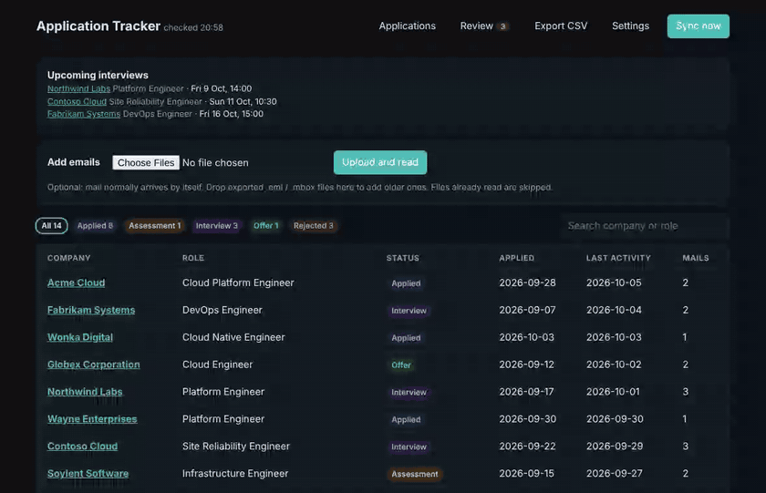
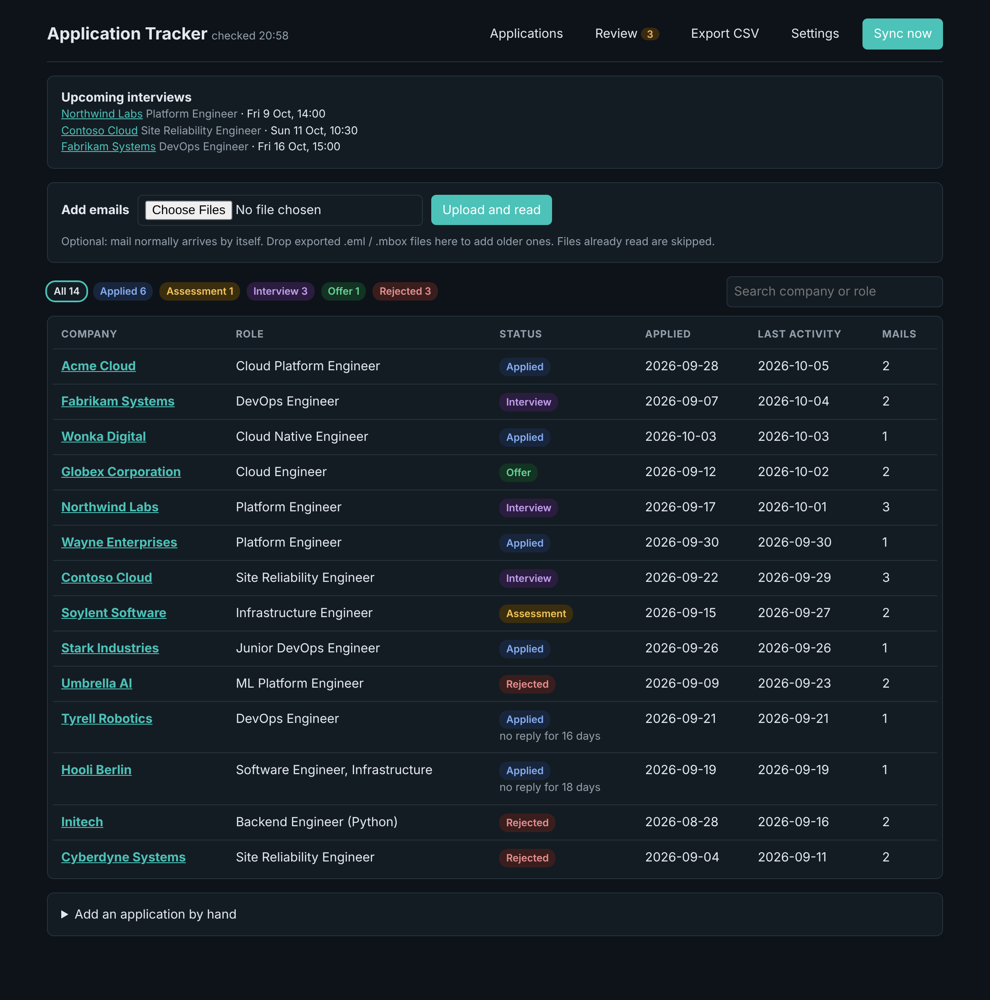
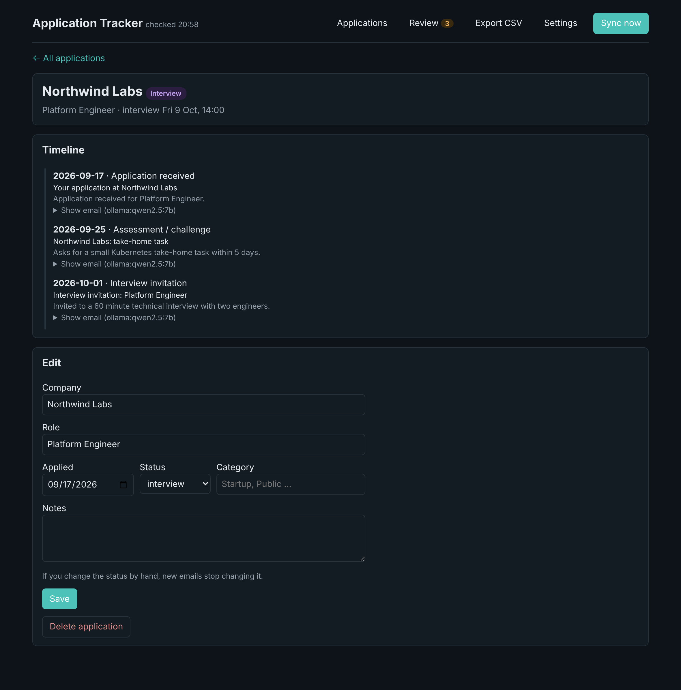
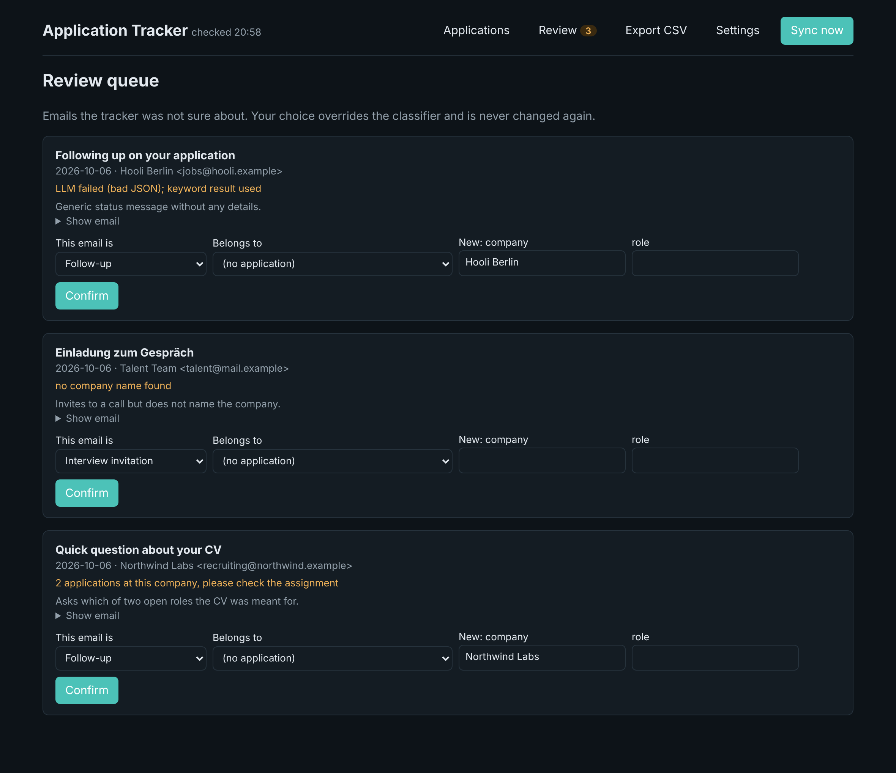
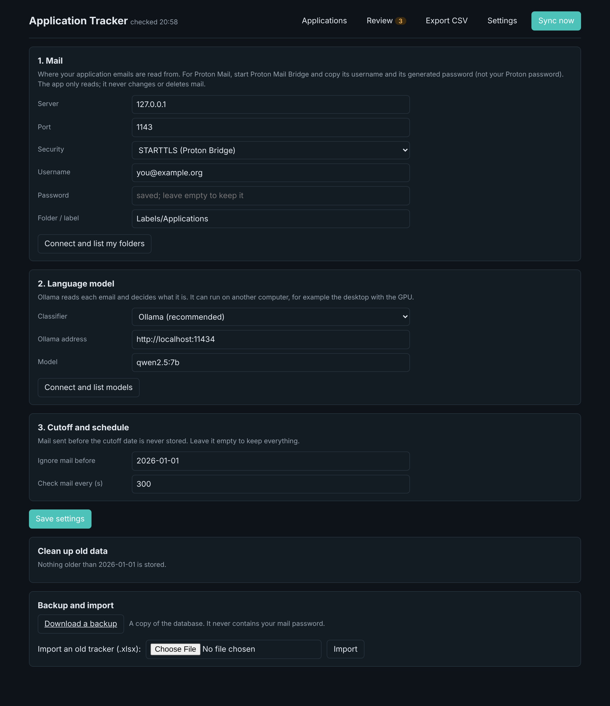
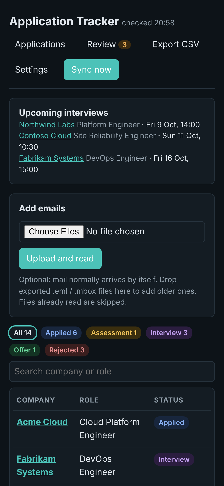

# Application Tracker

Reads your job-application emails, works out what each one is (confirmation, interview invite, rejection ...),
links it to the right application and keeps a status board up to date. It runs on your own machines: your
emails, the database and the language model (Ollama) never go to a cloud service.

<p align="center"></p>

| Dashboard | One application |
|---|---|
|  |  |

| Review queue | Settings | On a phone |
|---|---|---|
|  |  |  |

*The screenshots show invented companies and people (generated by `scripts/demo`), not real mail.*

## What it does

- **Reads mail by itself.** It polls one folder or label over IMAP (built for Proton Mail Bridge, works with any
  IMAP account) and never changes your mailbox: read-only, nothing is marked as read, moved or deleted.
- **Classifies with a local model.** Ollama returns type, company, role, interview time and a one-line summary for
  each email. If the model's computer is asleep, mail waits in a queue and is classified later. Nothing is lost.
- **Links mail to applications.** By email thread first, then company, then the job title and the sender. Two job
  titles at one company are two applications. Status follows the emails in time order: applied, assessment,
  interview, offer; a rejection closes it, and a later positive mail reopens it.
- **Asks only when it must.** The Review page holds mail it cannot place, for example an invite that names no
  company, or a reply that could belong to several applications. Your decision is final and never overwritten.
- **Everything is set up in the dashboard.** Mail connection, folder and model pickers, cutoff date, clean-up,
  backup download, spreadsheet import. After the first start you never need a terminal.

## Quick start (Windows, about five minutes)

1. Install Python 3.11 or newer and [Ollama](https://ollama.com); then `ollama pull qwen2.5:7b`.
2. For Proton Mail: start Proton Mail Bridge (paid plan) and keep its username and generated password at hand.
3. Double-click `run.bat`, open http://127.0.0.1:5055 and follow the banner to **Settings**: connect your mail,
   pick the folder and the model, press Save. Mail starts loading immediately.

On Linux or macOS: `python -m venv .venv && .venv/bin/pip install -r requirements.txt && .venv/bin/python -m tracker`.

To run it all day on an always-on machine, reach it from your phone, and keep the model on a different computer,
follow **[SETUP.md](SETUP.md)**.

## Run in a container or on Kubernetes

The `Dockerfile` builds a small image (non-root, everything that changes lives in the `/data` volume):

```
docker build -t application-tracker .
docker run -d -p 127.0.0.1:5055:5055 -v tracker-data:/data application-tracker
```

Inside a container the app listens on all interfaces, which is correct there; the port mapping above is what keeps it
local. **Publish it only to 127.0.0.1 or put it behind something that checks who you are**, because the dashboard has no
login. Mail needs a Proton Mail Bridge the container can reach: set the host on the Settings page, or run Bridge as a second
container in the same pod and use `127.0.0.1`. `GET /healthz` is a cheap probe that does not touch the database or the model.

A complete Kubernetes setup (Argo CD, Bridge in the same pod, Tailscale-only access, NetworkPolicy, nightly backup) is described in the author's
[homelab-dev](https://github.com/tmukh/homelab-dev) repository.

## Privacy and safety

- Mail is read-only and classification runs on your own Ollama model. The data lives in one local SQLite file
  (`data/tracker.db`). Your mail password is stored in `data/settings.json`, not in the database, so database
  backups never contain it; the browser never gets it back.
- **The dashboard has no login.** It listens on 127.0.0.1 only. To use it from a phone, put it behind something
  that checks who you are, such as Tailscale Serve (not Funnel, which is public). Never expose it to the internet.
- The app refuses form posts that come from other websites, so a page open in another tab cannot change your
  settings. It also refuses to send a saved password to a new mail server unless you type it again.
- Ollama has no login either. Allow its port only from your Tailscale network (see SETUP.md).

## Other mail providers

Any IMAP account works. For Gmail (not tested by the author): turn on 2-step verification, create an app password,
then in Settings use server `imap.gmail.com`, port `993`, security SSL, your address and the app password. Press
"Connect and list my folders" to see the exact label names.

## Date cutoff

Mail sent before a date is never stored (default 2026-01-01; set it in Settings, empty means no cutoff). After raising
it, Settings shows how much is now older and a button to delete it, with a backup made first. Lowering it makes the
next check read the folder from the start again; duplicates are skipped.

## How it decides things

- **The model decides.** The local model's answer stands. A set of German and English keyword rules runs as a
  fallback if the model returns unusable output; that mail is flagged for you. Small models are good, not perfect:
  fix mistakes on the Review page.
- **Thread, then company, then sender.** Replies are linked through the email headers. If that fails, by company
  name, then by the sender's domain (recruiting platforms such as Personio or Greenhouse are ignored, as they write
  for many employers). A recruiter who already wrote about one application is a strong hint, even from another address.
- **A confirmation means a new application** unless the same job title is already tracked.
- **Status is derived from emails.** An application created from mail takes its status only from the mail that still
  exists, so history removed by the cutoff cannot leave a stale status behind.
- **A status you set by hand is locked**, so emails stop changing it. Tick "Let emails update the status again" to undo.
- **No answer for 14 days** is shown under "applied".

## Layout

```
tracker/ingest.py       reads .eml/.mbox/IMAP messages into plain dicts
tracker/imap_source.py  read-only IMAP access
tracker/classify.py     Ollama classifier and keyword fallback
tracker/linker.py       which application an email belongs to, and the status rules
tracker/pipeline.py     the workflow: collect, classify, link, one-time data fixes
tracker/service.py      the background worker
tracker/settings.py     settings saved from the dashboard
tracker/app.py          the web dashboard (and /healthz for container probes)
deploy/                 systemd units and installer for an always-on machine
scripts/                publishing check, demo data and screenshot generator
tests/                  pytest suite (fake mail server and fake Ollama, no network needed)
```

Advanced commands such as `python -m tracker sync`, `prune`, `backup` and `imap-list` exist for scripts and the
systemd timer; they are never required.

## Development

```
pip install -r requirements.txt pytest
python -m pytest
```

Regenerate the screenshots on invented data (needs `pip install playwright && playwright install chromium`, and ffmpeg for the GIF):

```
TRACKER_DATA=/tmp/demo python scripts/demo/seed.py
TRACKER_DATA=/tmp/demo python scripts/demo/serve_demo.py 5077 &
python scripts/demo/screenshots.py http://127.0.0.1:5077 docs/images
```

Before every push run `bash scripts/prepublish-check.sh`. It fails if a database, mail file, spreadsheet, PDF or
filled-in `.env` is tracked by git or in its history.

## Limits

- Tested with Proton Mail Bridge and Ollama (qwen2.5:7b). Gmail and other providers are untested.
- Classification quality depends on the model. Check the Review page while you get started.
- Role matching relies on the job titles the model extracts; an odd or empty title can put a mail on the wrong
  application. Fix it on the Review page or in the application's page.

## License

MIT, see [LICENSE](LICENSE).
